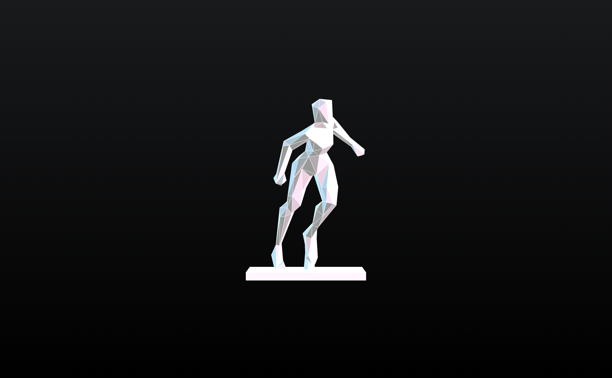

# ChartJS
A template to start building Dashboard using features from ChartJS.

# Panels template
A [template](https://github.com/qmonmous/Webdesign-JS-CSS/tree/master/panels-template) for creating cool one-page navigations.

# 3D STL loader
A template to add a 3D STL file that **tracks your mouse**.

